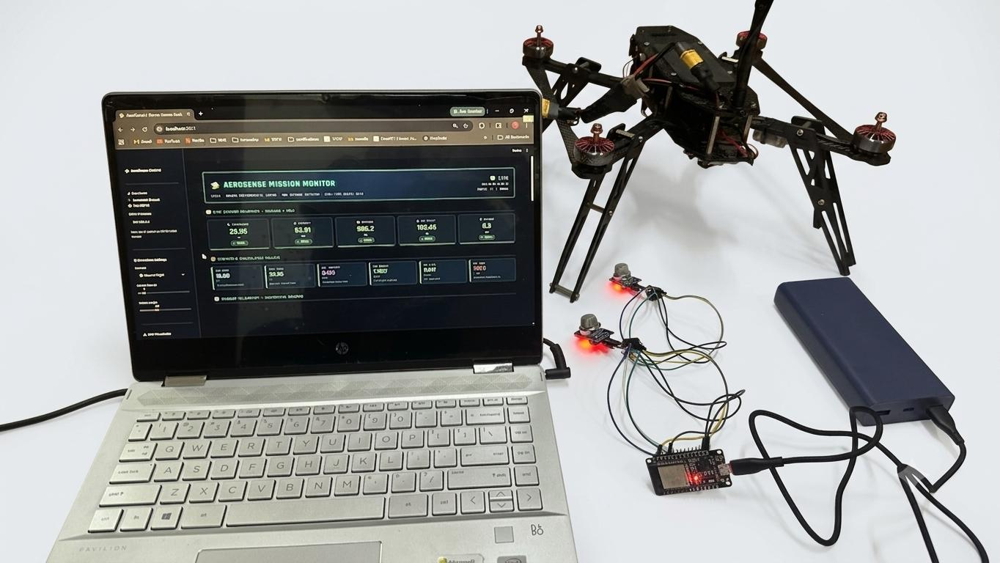
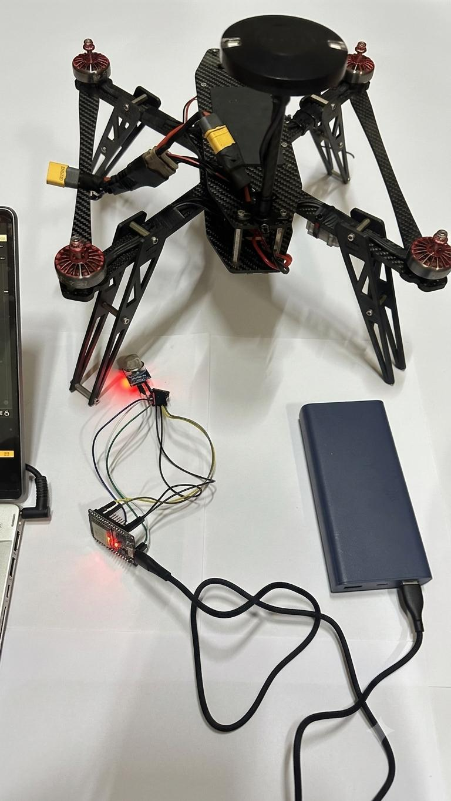

# 🛸 AeroSense: Drone Environmental Monitoring System

## 📌 Overview

AeroSense is an IoT-based drone monitoring system that collects real-time environmental and gas data using onboard sensors and visualizes it through an interactive Streamlit dashboard.

The system integrates a microcontroller with sensors and transmits data over Wi-Fi to a web-based interface for live monitoring and analysis.

---

## 🚀 Features

* 📡 Real-time sensor data streaming
* 🌡 Temperature, Humidity, and Pressure monitoring
* ⚗️ Methane (CH4) gas detection using MQ4 sensor
* 📊 Interactive graphs and analytics dashboard
* 🚨 Alert system for threshold-based warnings
* 🧮 Derived metrics (Dew Point, Heat Index, Air Density, etc.)
* 🌐 Wi-Fi based communication between device and dashboard

---

## 🧰 Hardware Used

* ESP32 microcontroller
* BME680 environmental sensor (I²C)
* MQ4 methane gas sensor (Analog)
* Breadboard and jumper wires

---

## 🔌 Circuit Connections

### BME680 (I²C)

* VCC → 3.3V
* GND → GND
* SDA → GPIO 21
* SCL → GPIO 22

### MQ4 (Analog)

* VCC → 5V (VIN)
* GND → GND
* AOUT → GPIO 34 (via voltage divider)

> ⚠️ Note: MQ4 outputs up to 5V. Use a voltage divider before connecting to ESP32 ADC.

---

## 🧠 System Architecture

Sensors → ESP32 → Wi-Fi → Streamlit Dashboard → Visualization

---

## 💻 Software Stack

* Python (Streamlit)
* Pandas, NumPy
* Plotly (data visualization)
* Arduino IDE (ESP32 firmware)

---

## ⚙️ Setup Instructions

### 1. Clone the repository

```
git clone https://github.com/your-username/AeroSense-Drone-Monitor.git
cd AeroSense-Drone-Monitor
```

### 2. Install dependencies

```
pip install -r requirements.txt
```

### 3. Run the dashboard

```
streamlit run streamlit_app/app.py
```

### 4. Connect to ESP32

* Power the ESP32
* Connect your PC to the same Wi-Fi network
* Enter ESP32 IP address in the dashboard sidebar

---

## 📷 Demo

### Streamlit Dashboard

| Dashboard View 1 | Dashboard View 2 |
|---|---|
|  |  |

### Actual Setup

| Setup Photo 1 | Setup Photo 2 |
|---|---|
|  |  |

---

## 🔮 Future Improvements

* GPS integration for location tracking
* Cloud data storage (Firebase / AWS)
* Mobile app interface
* Drone flight integration with real-time mapping

---

## 🧪 Applications

* Environmental monitoring
* Gas leak detection
* Smart agriculture
* Industrial safety systems
* Drone-based sensing missions

---

## 🛡️ Notes

* Do not expose Wi-Fi credentials in public repositories
* Ensure proper voltage regulation for sensors

---

## 👩‍💻 Author

Saarika Rajen

---

## ⭐ Acknowledgements

* Open-source libraries and IoT community
* Sensor manufacturers documentation

---
